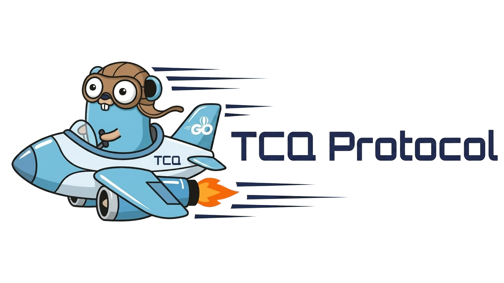

  

# TCQ Network Protocols (Thread Controlled Quick)

TCQ is an implementation of the QUIC protocol but adds several features that allow for bandwidth optimization, processing flow optimization, CPU optimization, and data compression. ([RFC 9000](https://datatracker.ietf.org/doc/html/rfc9000), [RFC 9001](https://datatracker.ietf.org/doc/html/rfc9001), [RFC 9002](https://datatracker.ietf.org/doc/html/rfc9002)) in Go. It has support for HTTP/3 ([RFC 9114](https://datatracker.ietf.org/doc/html/rfc9114)), including QPACK ([RFC 9204](https://datatracker.ietf.org/doc/html/rfc9204)) and HTTP Datagrams ([RFC 9297](https://datatracker.ietf.org/doc/html/rfc9297)).

In addition to these base RFCs, it also implements the following RFCs:

* Unreliable Datagram Extension ([RFC 9221](https://datatracker.ietf.org/doc/html/rfc9221))
* Datagram Packetization Layer Path MTU Discovery (DPLPMTUD, [RFC 8899](https://datatracker.ietf.org/doc/html/rfc8899))
* QUIC Version 2 ([RFC 9369](https://datatracker.ietf.org/doc/html/rfc9369))
* QUIC Event Logging using qlog ([draft-ietf-quic-qlog-main-schema](https://datatracker.ietf.org/doc/draft-ietf-quic-qlog-main-schema/) and [draft-ietf-quic-qlog-quic-events](https://datatracker.ietf.org/doc/draft-ietf-quic-qlog-quic-events/))
* QUIC Stream Resets with Partial Delivery ([draft-ietf-quic-reliable-stream-reset](https://datatracker.ietf.org/doc/html/draft-ietf-quic-reliable-stream-reset-07))

Support for WebTransport over HTTP/3 ([draft-ietf-webtrans-http3](https://datatracker.ietf.org/doc/draft-ietf-webtrans-http3/)) is implemented in [webtransport-go](https://github.com/quic-go/webtransport-go).

## Release Policy

The TCQ protocol always aims to update to the latest versions.

## Contributing

We are always happy to welcome new contributors. If you have any questions, please feel free to reach out by opening an issue or leaving a comment [issues](https://github.com/TCQ-Protocol/TCQ_PROTOCOL/issues).

## License

The code is licensed under the GNU General Public License v3.0. The logo and brand assets are excluded from the GNU General Public License v3.0. See [assets/LICENSE.md](https://github.com/TCQ-Protocol/TCQ_PROTOCOL/blob/master/LICENSE) for the full usage policy and details.
